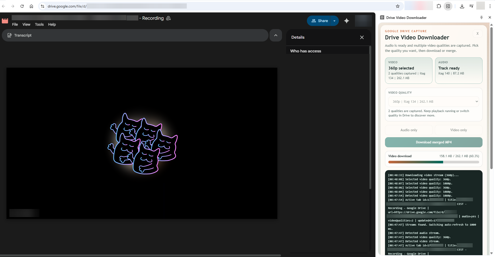

# gdrive-downloader

Chrome extension for downloading Google Drive viewer streams as:

- audio only
- video only
- merged MP4 via `ffmpeg.wasm`

The extension:

- captures `videoplayback` stream URLs from the active Google Drive tab
- downloads media with parallel range requests
- rewrites `Origin` / `Referer` for Drive media fetches
- muxes audio + video in the browser with `ffmpeg.wasm`

## Demo



## Download Ready Build From GitHub Actions

If you do not want to build locally:

1. Open the repository `Releases` section on GitHub.
2. Open the latest release for `main` or `master`.
3. Download the attached zip named like:

   ```text
   drive-video-downloader-main.zip
   ```

4. Unzip it.
5. Open `chrome://extensions`.
6. Enable `Developer mode`.
7. Click `Load unpacked`.
8. Select the unzipped `drive-video-downloader` folder.

If you want a build from a workflow run that was not published as a release:

1. Open the repository `Actions` tab on GitHub.
2. Open the successful `Build Extension` workflow run.
3. Download the artifact named like:

   ```text
   drive-video-downloader-1.0.0
   ```

4. Unzip it.
5. Open `chrome://extensions`.
6. Enable `Developer mode`.
7. Click `Load unpacked`.
8. Select the unzipped `drive-video-downloader` folder.

## How To Use

1. Open a Google Drive video page in Chrome.
2. Click the extension icon to open the side panel.
3. Start playback in the Drive player.
4. Wait until the extension captures audio and at least one video stream.
5. If you want a different quality, change quality in the Drive player and keep the side panel open.
6. Choose the captured quality in the `Video quality` selector.
7. Click one of:

   - `Audio only`
   - `Video only`
   - `Download merged MP4`

## Notes

- The side panel keeps polling while it is open, so you can open it before starting playback.
- The quality selector only shows video qualities that the Drive player has already requested in the current tab.
- Merging is done in-browser with `ffmpeg.wasm`, so large files can use a lot of RAM.
- If you close the side panel during a download or merge, the current job stops.
- `extension/ffmpeg/` is generated during build and should not be edited manually.
- `dist/drive-video-downloader/` is the folder to load into Chrome.

## Requirements

- Node.js 18+ recommended
- Google Chrome with `Developer mode` enabled on `chrome://extensions`

## Build

1. Install dependencies:

   ```bash
   npm install
   ```

2. Build the unpacked extension:

   ```bash
   npm run build
   ```

`npm run build` will:

- prepare `extension/ffmpeg/` from the installed `@ffmpeg/*` packages
- validate the extension source files
- create a loadable build in:

```text
dist/drive-video-downloader
```

## Install In Chrome

1. Run `npm run build`.
2. Open `chrome://extensions`.
3. Enable `Developer mode`.
4. Click `Load unpacked`.
5. Select:

   ```text
   dist/drive-video-downloader
   ```

6. Pin `Drive Video Downloader` if you want fast access from the toolbar.

## Reload After Changes

For normal development updates:

1. Run:

   ```bash
   npm run build
   ```

2. Open `chrome://extensions`.
3. Find `Drive Video Downloader`.
4. Click `Reload`.

## Reinstall From Scratch

Use this if the unpacked extension path is lost or the extension needs a clean reinstall.

1. Run:

   ```bash
   npm run build
   ```

2. Open `chrome://extensions`.
3. Click `Remove` on `Drive Video Downloader`.
4. Click `Load unpacked`.
5. Select:

   ```text
   dist/drive-video-downloader
   ```

## Optional Validation

If you only want to verify the source extension files:

```bash
npm run prepare:extension
npm run check:extension
```

## IntelliJ IDEA

A shared run configuration is included in:

```text
.run/Build Extension.run.xml
```

In IntelliJ IDEA, open the run configurations dropdown and choose `Build Extension`, then click `Run` for a one-click `npm run build`.

## License

This repository is licensed under `GPL-3.0-only`.

That is intentional: `Apache-2.0` would allow proprietary forks, but `GPL-3.0` matches your goal of keeping redistributed forks open-source.
